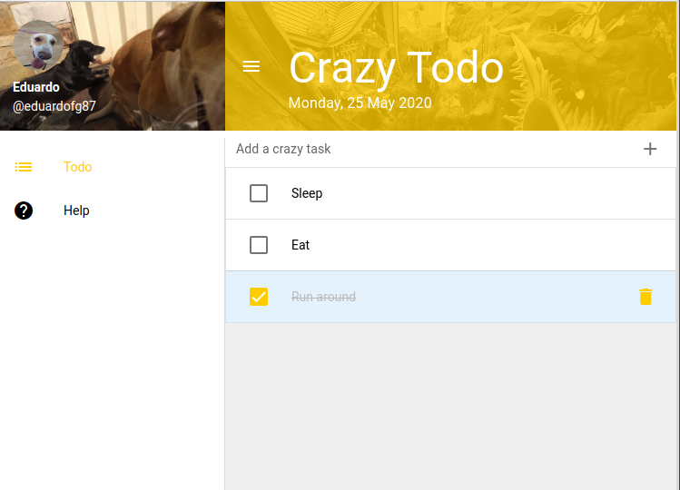

# Quasar Crazy Todo List (quasar-crazy-todo-list)

[](https://app.netlify.com/sites/amazing-meitner-47b758/deploys)

A crazy todo list made with Vue.JS and Quasar , check it online [HERE](https://quasar-crazy-todo-list.netlify.app/)



## Install the dependencies
```bash
yarn
```

### Start the app in development mode (hot-code reloading, error reporting, etc.)
```bash
quasar dev
```

### Lint the files
```bash
yarn run lint
```

### Build the app for production
```bash
quasar build
```
## References
1. [Create an App for Android, iOS, Mac & Windows - in 30 MINUTES!](https://www.youtube.com/watch?v=GV-D85D9KJQ)
