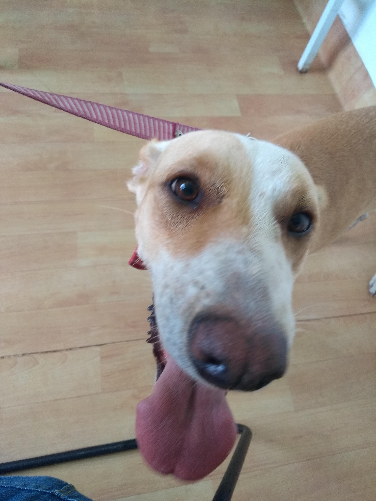

# About

This is a POC for study, here I learned to use some features of Quasar Framework, basically it is a to do app that one can create new task, mark as done and delete the tasks.

In the images the principal actress is my female dog Layla, she is so cute, isn't she?

